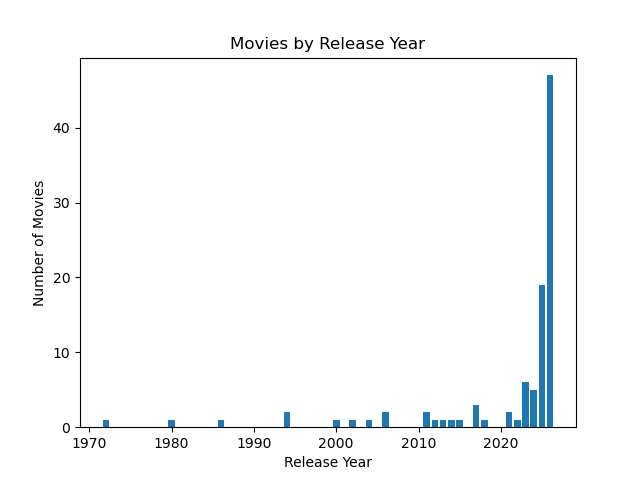

# Movie Data Pipeline 

This project builds a data project pipeline that collects movie data from the TMDB API, transforms it using Python and Pandas, stores it in a SQLite database, and generates analytical insights. 

## Features

- API data extraction
- Data transformation
- SQLite database loading
- Interactive SQL query tool
- Data visualization
- Modular pipeline architecture

## Tech Stack

- Python
- Pandas
- SQLite
- TMDB API
- Matplotlib

## Project Structure

```text
src/
database/
outputs/
notebooks/
```

## Pipeline Steps

1. Extract movie data from TMDB API
2. Transform raw JSON into a structured dataset
3. Load the dataset into a SQLite database
4. Run SQL analysis queries
5. Generate visualizations 

## Running the Pipeline

```bash
python run_pipeline.py
```

## Running Custom SQL Queries
```bash
python query_tool.py
```

## Example Visualization

